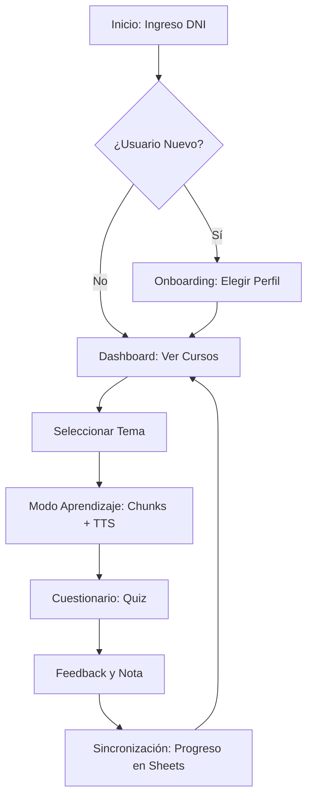
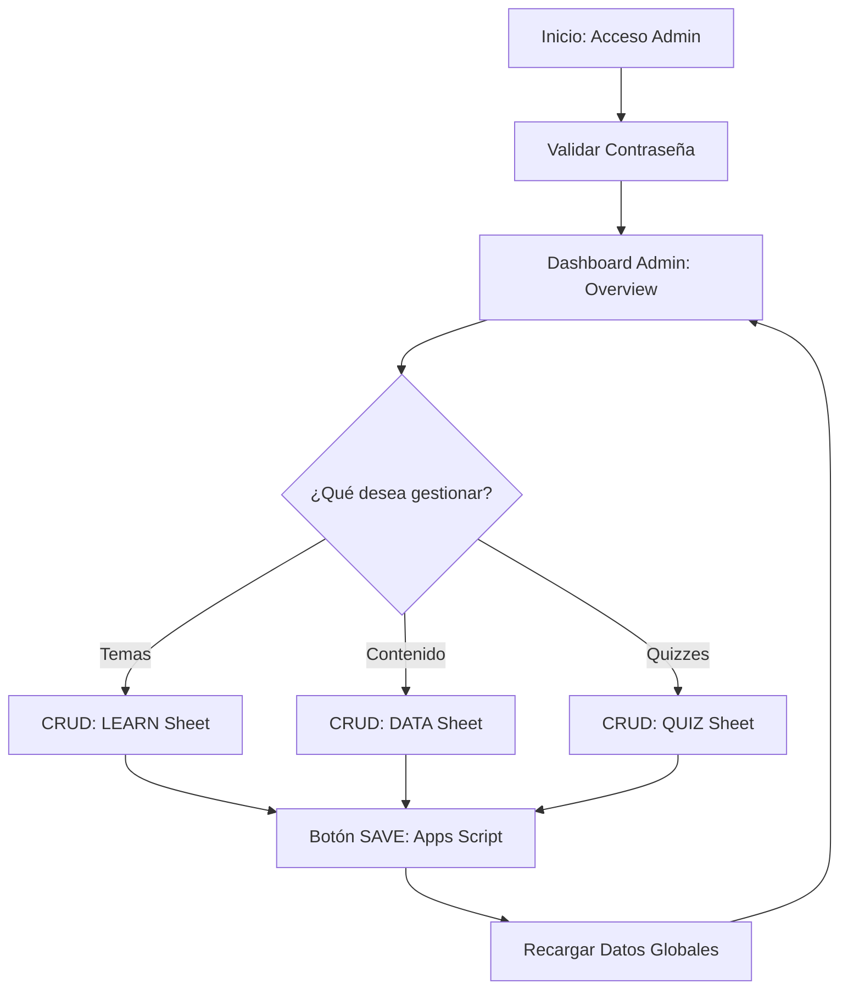

# LearnDrive v2.1 🚀 | Professional Learning Platform

**LearnDrive** es una solución integral de aprendizaje corporativo *mobile-first* diseñada para entornos industriales y operativos. Utiliza **React 19** y **Google Sheets como base de datos viva**, permitiendo una gestión de capacitación ágil y escalable sin dependencias de servidores complejos.

---

## 🌟 Funcionalidad del Proyecto

La plataforma está dividida en dos experiencias principales diseñadas para maximizar la eficiencia en la capacitación y la gestión de contenidos.

### 1. 🎓 Experiencia del Usuario (Aprendizaje)
Diseñada para ser intuitiva y accesible en cualquier dispositivo móvil.
*   **Acceso por DNI**: Identificación rápida sin necesidad de contraseñas complejas.
*   **Perfiles Personalizados**: Contenido segmentado según el rol del usuario (Aprendiz, Líder, Docente).
*   **Modo Aprendizaje Guiado**: Lectura por bloques ("chunks") con soporte de **TTS (Text-to-Speech)** para manos libres.
*   **Evaluaciones con Feedback**: Quizzes interactivos que refuerzan el conocimiento con explicaciones inmediatas.
*   **Sincronización en la Nube**: El progreso y las notas se guardan automáticamente en Google Sheets.

### 2. 🔐 Panel Administrativo (Gestión)
Herramienta potente para los gestores de aprendizaje y administradores de contenido.
*   **Control Total CRUD**: Crea, edita y elimina Temas, Módulos de Contenido y Preguntas de Quiz.
*   **Visualización en Tiempo Real**: Previsualiza cómo se verá el contenido antes de guardarlo.
*   **Sincronización Directa**: Guarda los cambios directamente en las pestañas de Google Sheets (`LEARN`, `DATA`, `QUIZ`).
*   **Pruebas de Conexión**: Herramientas integradas para validar la comunicación con la API de Google Sheets y Apps Script.

---

## 🔄 Flujograma de Procesos

A continuación se detalla el flujo de trabajo tanto para el usuario como para el administrador:

### Flujo del Usuario Final


### Flujo del Administrador


---

## 🛠️ Stack Tecnológico

| Componente | Tecnología |
|---|---|
| **Frontend** | React 19 + Vite |
| **Estilos** | **Tailwind CSS 4** |
| **Animaciones** | Framer Motion |
| **Iconografía** | Lucide React |
| **Base de Datos** | Google Sheets (vía CSV Proxy) |
| **API Backend** | **Google Apps Script** (Proxy REST) |
| **Multimedia** | Google Drive API |

---

## 🚀 Instalación y Configuración

1.  **Clonar e Instalar**:
    ```bash
    npm install
    ```
2.  **Variables de Entorno (.env)**:
    ```env
    VITE_APPS_SCRIPT_URL=TU_URL_DE_APPS_SCRIPT
    ```
3.  **Google Sheets**: Utiliza un ID de hoja de cálculo con las pestañas `LEARN`, `DATA`, `QUIZ` e `INGRESOS`.
4.  **Despliegue**:
    ```bash
    npm run deploy
    ```

---

**LearnDrive v2.1** - *Capacitación corporativa moderna y ágil.*
